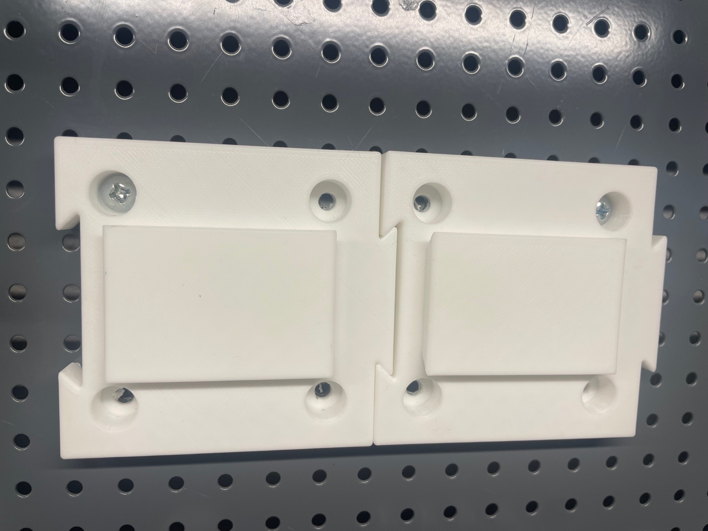
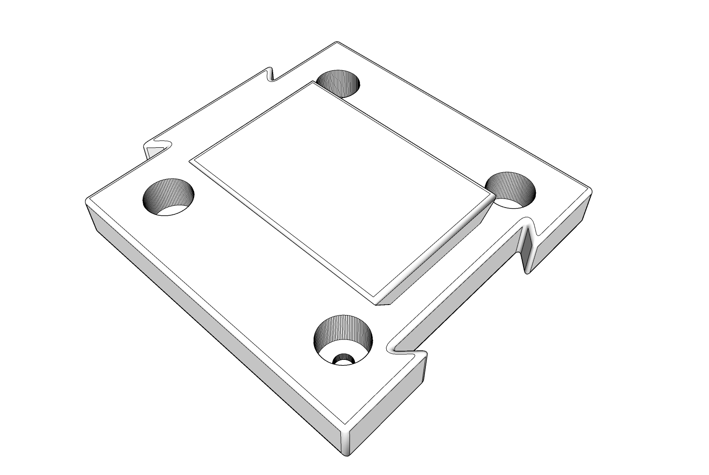

# MODULA - a module based tool holder system

Universal adapter for (metric) PEG boards, this one fits Biltema, Jula, Claes Ohlsson, CC 12mm (15/32 inch) spacing of the 4mm (5/32 inch) diameter screw holes.

